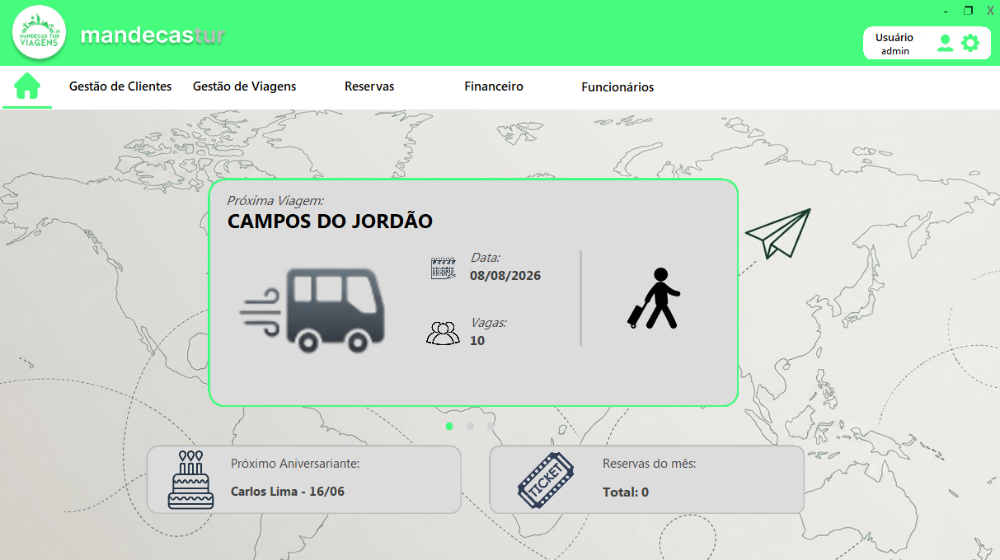
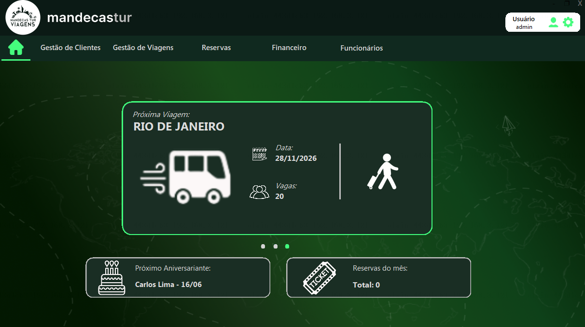
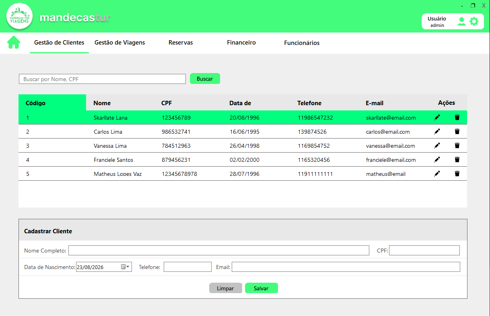
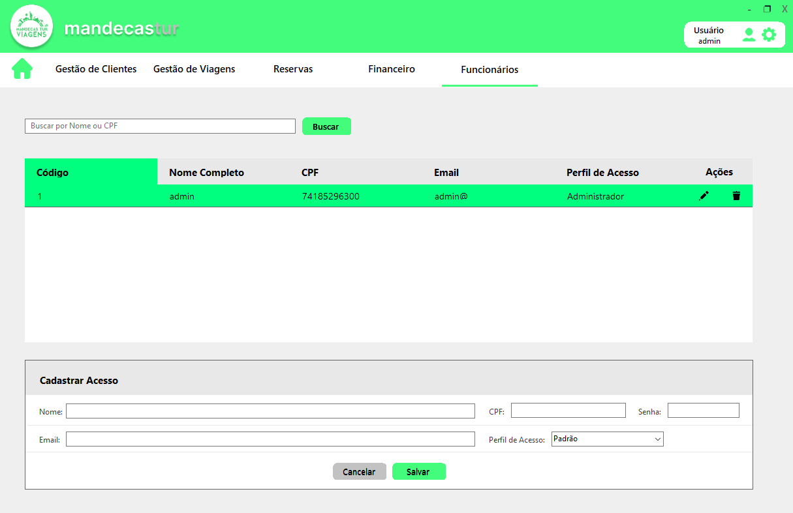
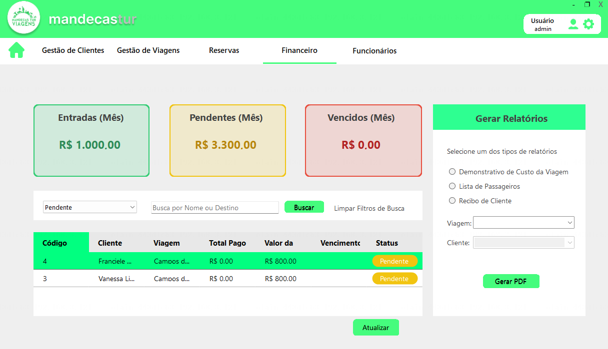

<h1 align="center">🚍 Mandecas Tur</h1>

Sistema de gestão para empresa de turismo, focado na automação de processos,
organização de clientes e controle de operações.

## 📌 Sobre o projeto

O **Mandecas Tur** é um sistema desenvolvido em **C#** com foco em facilitar o
gerenciamento interno da empresa Mandecas Tur, garantindo eficiência,
escalabilidade e organização dos dados.

## 📸 Galeria do Sistema

| Dashboard (Modo Padrão) | Dashboard (Green Mode) |
| :---: | :---: |
|  |  |

| Gestão de Clientes (Modo Padrão) | Gestão de Funcionários |
| :---: | :---: |
|  |  |

| Financeiro (Modo Padrão) | Gestão de Viagens |
| :---: | :---: |
|  |  |

---

## 🛠 Tecnologias Utilizadas
* **Linguagem:** C# (.NET Framework)
* **Interface:** Windows Forms (WinForms)
* **Banco de Dados:** MySQL
* **Ferramentas:** Visual Studio | XAMPP

## ⚙️ Funcionalidades Principais
* **Gestão de Clientes:** Cadastro, edição e exclusão de clientes com validação de dados.
* **Controle de Viagens:** Gestão de destinos, vagas e transporte.
* **Controle Financeiro:** Acompanhamento de receitas/despesas com status atualizado e geração de relatórios.
* **Gestão de Acessos:** Cadastro, edição e exclusão de funcionários com niveis de acesso.
* **Acessibilidade:** Design responsivo com suporte a modo escuro (Green Mode).

## 🚀 Como rodar o projeto
1. Clone este repositório: `git clone https://github.com/Frankss29/Projeto_Mandecas_Tur.git `
2. Abra a Solution no Visual Studio.
3. Certifique-se de configurar a connection string do banco de dados na pasta `database`.
4. Compile e execute o projeto!

## 🔑 Acesso de Teste
Para testar o sistema, você pode utilizar as seguintes credenciais cadastradas no banco de dados:

* **Usuário:** `admin@`
* **Senha:** `1239`

---
## 👥 Desenvolvido por:
* Franciele Santos
* Juliana Nascimento
* Melyssa Ezequiel
* Silas Bibiano
* Skarllate Lana
* Vanessa Lima

*Projeto desenvolvido como trabalho final de conclusão do curso Programador de Sistemas do Transforme-se.*